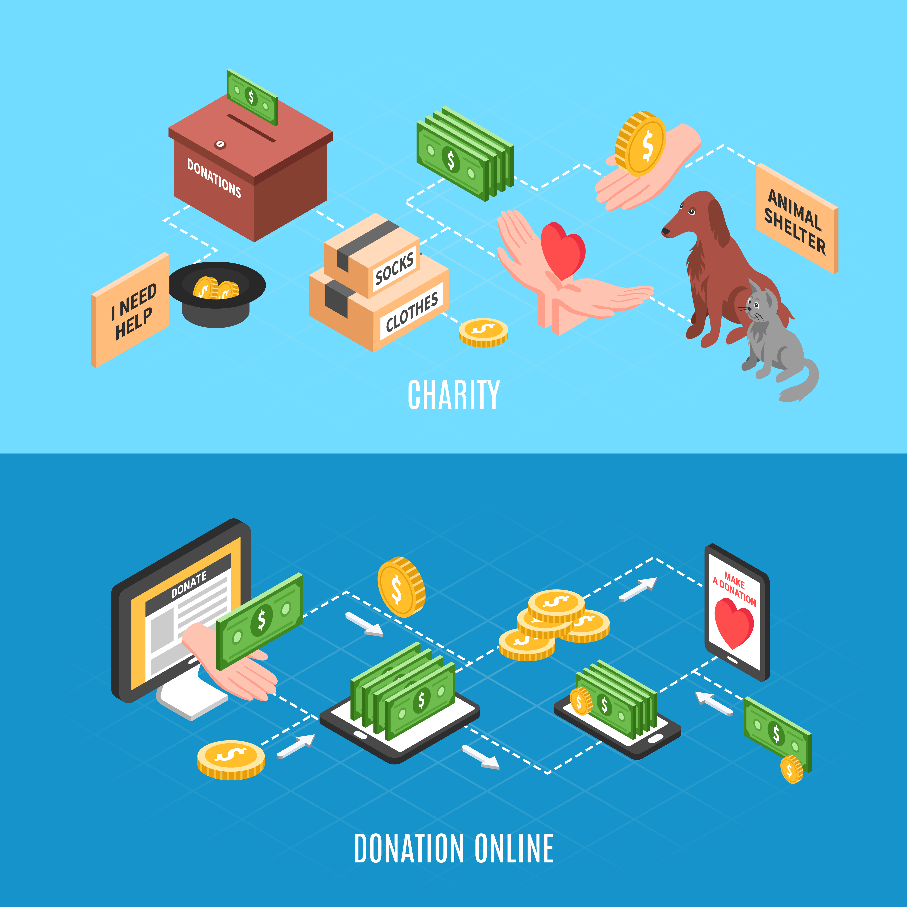
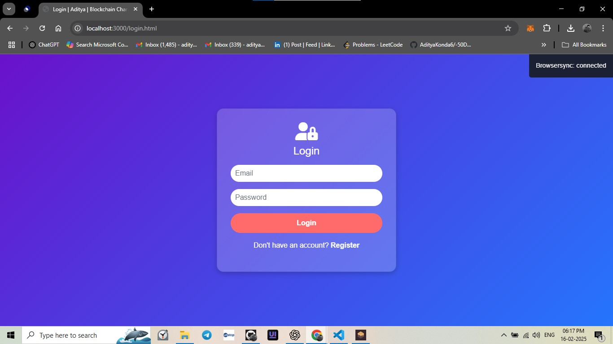
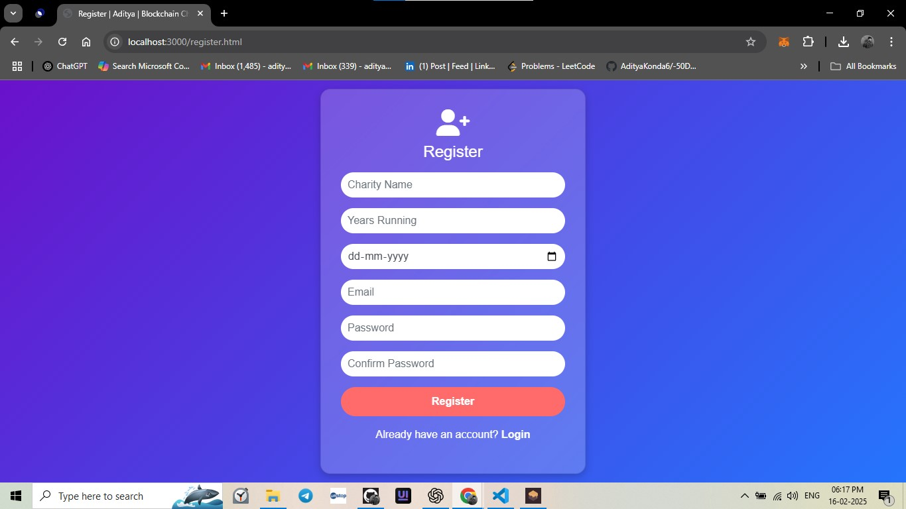
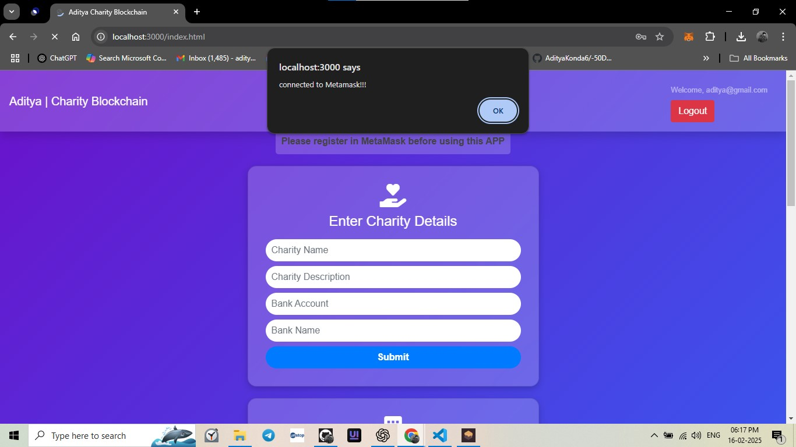
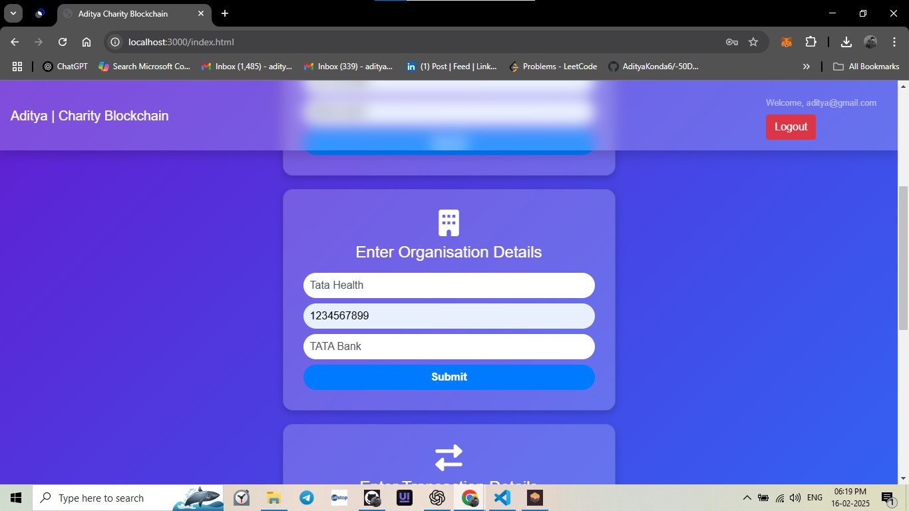
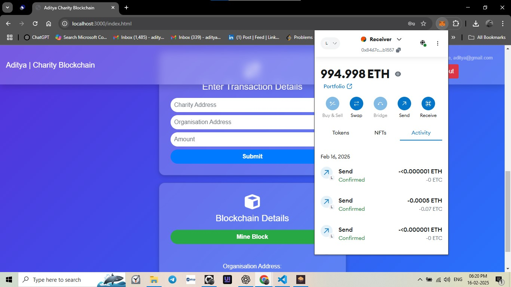

# Charity-Blockchain-Project-Aditya_Konda


## Introduction
The **Charity Blockchain Project** is a decentralized platform that ensures transparency and security in charitable donations using blockchain technology. The platform leverages smart contracts to facilitate secure transactions and prevent fraud, ensuring that funds reach the intended recipients.




## Features
- **Decentralized Donations**: Uses blockchain to securely transfer funds.
- **Smart Contracts**: Automates and ensures transparency in donations.
- **User Authentication**: Secure login with MetaMask.
- **Transaction Tracking**: Donors can track their funds on the blockchain.
- **Mining Blocks**: Transactions are verified and stored in blocks.
- **Organization Management**: NGOs can register and receive funds.

## Tech Stack
- **Frontend**: HTML, CSS, JavaScript
- **Backend**: Node.js, Express.js
- **Blockchain**: Ethereum, Solidity, Web3.js
- **Database**: MongoDB
- **Authentication**: MetaMask

## Installation Guide
Follow these steps to set up and run the project on your local machine:

### Prerequisites
- Node.js and npm installed
- MetaMask Extension in your browser
- Ganache for local blockchain testing

### Steps
1. **Clone the Repository**
   ```sh
   git clone https://github.com/AdityaKonda6/Charity-Blockchain-Project-Aditya_Konda.git
   cd Charity-Blockchain-Project-Aditya_Konda
   ```
2. **Install Dependencies**
   ```sh
   npm install
   ```
3. **Start the Blockchain (Ganache)**
   - Open Ganache and create a new workspace.
   - Configure it to use a local Ethereum network.

4. **Deploy Smart Contracts**
   ```sh
   truffle migrate --reset
   ```
5. **Run the Project**
   ```sh
   npm start
   ```
6. **Open in Browser**
   - Navigate to `http://localhost:3000`
   - Connect MetaMask and start donating!

## Project Workflow
1. **User Registration & Login**
   - Users register and log in using MetaMask.
   - They can view registered charities and their details.
   
2. **Making Donations**
   - Users send donations via the blockchain.
   - Transactions are verified through smart contracts.
   
3. **Mining and Verification**
   - Each donation is recorded as a block in the chain.
   - Miners verify transactions to ensure authenticity.

4. **Tracking Transactions**
   - Donors can track their donations via transaction IDs.
   - Transparency is maintained as all transactions are public.

## Screenshots
1. **Login Page**


2. **Register Page**
 

3. **Welcome**
 

4. **Charity Details**
 

5. **Organization**
 

6. **Organization Details**
 

7. **MetaMask Authentication**
 

8. **MetaMask**
 

9. **Copy Address For Sender**
 

10. **Copy Address Of Receiver For Transaction**
 

11. **Transfer Request**
 

12. **Transfer Confirmed**
 

13. **Mine A Block**
 

14. **Mine A Block Successful**
 

15. **Download Certificate**
 

16. **Certificate Proof**
  


## Contributing
Contributions are welcome! Feel free to fork this repository and submit pull requests.

## License
This project is licensed under the MIT License.

---
Developed by **Aditya Konda**


## Hey there 👋, I'm [<a href="https://adityakonda04.vercel.app/">Aditya!</a>](https://github.com/AdityaKonda6)

[](https://www.linkedin.com/in/aditya-adi-konda/)
[](https://twitter.com/AdityaKonda7)
[](https://www.instagram.com/konda_aditya/)


### Glad to see you here! &nbsp; 

I’m a **2025 IT Graduate** passionate about **DevOps, Cloud, and Software Development** 🚀.  
My mission? To **bridge the gap between development and operations**—building scalable systems, automating workflows, and ensuring quality from code to deployment.

With a strong foundation in **Java, SQL, Linux**, and hands-on experience with **CI/CD pipelines, Selenium automation, cloud services, and Android development**, I thrive in solving problems end-to-end—from writing code to deploying it in production.

Recently, at **CWD Limited**, I worked on:
- **Automation Testing Frameworks** (Selenium, Java, Maven)
- **Linux-based system configurations & debugging**
- **Hardware-software integration testing**
- API testing with Postman  
…and in the process, strengthened my DevOps skill set.

💡 Curious mind. Fast learner. Always ready to build, break, and rebuild—better.

---

### 🚀 What I’m Working On:
- Building **DevOps projects** (Jenkins, Docker, Kubernetes, AWS, Ansible)
- Enhancing **automation frameworks** for testing & deployment
- Crafting **Android apps** and backend services
- Expanding my **Linux administration** skills

---

### 💼 My Tech Stack:
<code></code>
<code></code>
<code></code>
<code></code>
<code></code>
<code></code>
<code></code>
<code></code>
<code></code>
<code></code>
<code></code>
<code></code>
<code></code>

---


### 📌 Highlights:
- 🛠 Built **dynamic Selenium automation scripts** integrated with Maven
- 🚀 Created & deployed **full-stack and Android applications**
- 🐧 Comfortable with **Linux system administration & shell scripting**
- 📦 Implemented CI/CD workflows for smoother deployments
- ☁️ Learning & applying **cloud infrastructure concepts**

--

### 📫 How to Reach Me:
- Email: **adityakonda04@gmail.com**
- Portfolio: [adityakonda04.vercel.app](https://adityakonda04.vercel.app/)
- LinkedIn: [Aditya Adi Konda](https://www.linkedin.com/in/aditya-adi-konda/)

---

### 📊 GitHub Stats:
<details>
  <summary><b>⚡ GitHub Stats</b></summary>
  <br />
  
  
</details>

<details>
  <summary><b>🔥 GitHub Streaks</b></summary>
  <br />
  
</details>

<details>
  <summary><b>☄️ LeetCode Stats</b></summary>
  <br />
   <p align="center"></p>
</details>

---

💬 Always open to collaborations, tech discussions, and exploring new opportunities in **DevOps, Cloud, and Software Development**.


Like My Work?

<a href="https://www.buymeacoffee.com/adityakonda04" target="_blank"></a>

<p align="left">  </p>

<p align="left"> <a href="https://github.com/ryo-ma/github-profile-trophy"></a> </p>


<div align="center">

### Show some ❤️ by starring some of the repositories!
### <a href="https://adityakonda04.vercel.app/">My Portfolio</a>
</div>

